<html>
    <head>
        <title>The LaSallian | Defending truth in tough times</title>
        <meta charset="utf-8">
        <meta name="viewport" content="width=device-width, initial-scale=1">
        <link rel="stylesheet" href="https://cdn.jsdelivr.net/npm/uikit@3.5.5/dist/css/uikit.min.css"/>
        
        
        <link rel="stylesheet" href="ebrice.css">
    </head>
    <body>
        <!-- Cover -->
        <section id="top">
            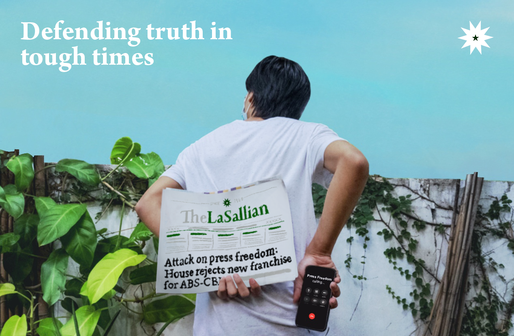
            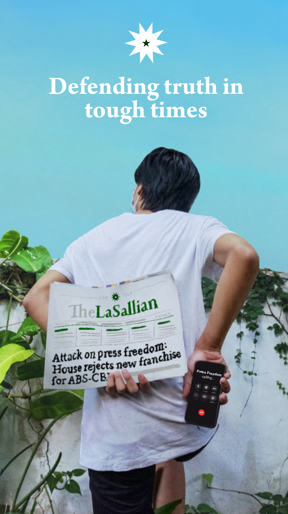
        </section>

        <!-- iPad and Desktop NavBar -->
        

            <nav class="uk-navbar-container uk-margin uk-visible@s" id="shadow" uk-navbar>
                

                    

                        <ul class="uk-navbar-nav">
                            <li class="uk-active"><a href="#timeline" uk-scroll>The Media Struggles</a></li>
                            <li class="uk-active"><a href="#pwl" uk-scroll>In Closed Quarters</a></li>
                        </ul>
                    

                    
                    

                        <ul class="uk-navbar-nav">
                            <li class="uk-active"><a href="#articles" uk-scroll>Articles</a></li>
                            <li class="uk-active"><a href="#wots" uk-scroll>Vox Populi</a></li>
                        </ul>
                    

                

            </nav>
        

        <!-- iPhone NavBar -->
        

            <nav class="uk-navbar-container uk-margin uk-hidden@s" id="shadow" uk-navbar>
                

                    
                    
                

                

                    
                

            </nav>
        

        

            

                <ul class="uk-nav uk-nav-primary uk-nav-center uk-margin-auto-vertical">
                    <li class="uk-active"><a href="#timeline">The Media Struggles</a></li>
                    <li class="uk-active"><a href="#pwl">In Closed Quarters</a></li>
                    <li class="uk-active"><a href="#articles">Articles</a></li>
                    <li class="uk-active"><a href="#wots">Vox Populi</a></li>
                </ul>
        
            

        

        <!-- About the Cover and Editor's Note -->
        <section id="about">
            

                

                     <!-- Desktop -->
                     

                        

                            <h2><b>Editor's Note</b></h2>
                            
Lorem ipsum dolor sit amet, consectetur adipiscing elit, sed do eiusmod tempor incididunt ut labore et dolore magna aliqua. 
                                Ut enim ad minim veniam, quis nostrud exercitation ullamco laboris nisi ut aliquip ex ea commodo consequat. 
                                Duis aute irure dolor in reprehenderit in voluptate velit esse cillum dolore eu fugiat nulla pariatur. 
                                Excepteur sint occaecat cupidatat non proident, sunt in culpa qui officia deserunt mollit anim id est laborum.
                                  <b>Erinne Ong</b> Editor-in-Chief

                        

                        

                            <h2><b>About the Cover</b></h2>
                            
The cover tells a timeless narrative about the dangers to press freedom. 
                                Drawing from history, Philippine media has continuously struggled to promote and defend the truth. 
                                Our present is no exception—peering through controlled facades reveals we are in dark times indeed.

                        

                    

                    <!-- iPhone -->
                    

                        <h2><b>Editor's Note</b></h2>
                        
Lorem ipsum dolor sit amet, consectetur adipiscing elit, sed do eiusmod tempor incididunt ut labore et dolore magna aliqua. 
                            Ut enim ad minim veniam, quis nostrud exercitation ullamco laboris nisi ut aliquip ex ea commodo consequat. 
                            Duis aute irure dolor in reprehenderit in voluptate velit esse cillum dolore eu fugiat nulla pariatur. 
                            Excepteur sint occaecat cupidatat non proident, sunt in culpa qui officia deserunt mollit anim id est laborum.
                              <b>Erinne Ong</b> Editor-in-Chief

                    

                    

                        <h2><b>About the Cover</b></h2>
                        
The cover tells a timeless narrative about the dangers to press freedom. 
                            Drawing from history, Philippine media has continuously struggled to promote and defend the truth. 
                            Our present is no exception—peering through controlled facades reveals we are in dark times indeed.

                    

                

            

        </section>

        <!-- The Media Struggles -->
        <section id="timeline">
            

                

                    <h3 id="kicker"><b>TIMELINE</b></h3>
                    <h1 id="title"><b>Media Struggles in the Philippines</b></h1>
                    
by <b>Jan Emmanuel Alonzo, Rafael Gabriel Arceo, John Robert Lee,</b> & <b>Glenielle Geraldo Nanglihan</b> Illustration by <b>Jacob Dy</b> & <b>Ruaina Moreno</b>

                    

                    
Even after the EDSA Revolution, Philippine media has encountered several obstacles from closures   to lawsuits.
                    <b>The LaSallian</b> looks back at the decades worth of struggle journalists had to endure starting from the Cory administration
                    up until the recent shutdown of ABS-CBN.</b>

                    
Even after the EDSA Revolution, Philippine media has encountered several obstacles from closures to lawsuits.
                        <b>The LaSallian</b> looks back at the decades worth of struggle journalists had to endure starting from the Cory administration
                        up until the recent shutdown of ABS-CBN.</b>
 
                    <!-- Displaying infographic for iPad and larger-->
                    
                    <!-- Infographic button for iPhone -->
                    

                        <a class="uk-button uk-button-default uk-width-1-1 uk-hidden@s" href="assets/Infographic/infographic.png">View Infographic</a>
                    

                

            

        </section>
        

        <!-- Painting With Light -->
        <section id="pwl">
            

                

                    <h3 id="kicker"><b>PAINTING WITH LIGHT</b></h3>
                    <h1 id="title"><b>In Closed Quarters</b></h1>
                    

                    
With a pandemic changing the world as we know it, <b>The LaSallian</b> takes a look at how  
                        journalism remains steadfast in delivering the truth despite the difficult circumstances.
 
                    
                     

                        

                            

                                

                                    

                                        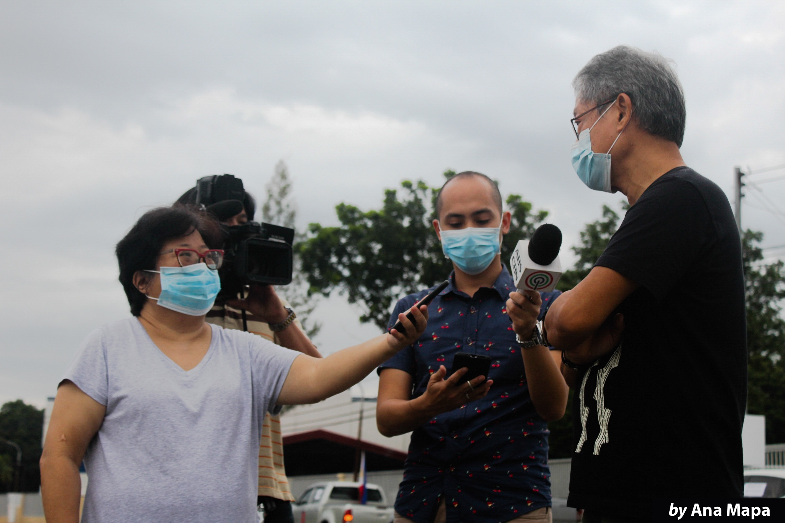
                                    

                                

                            

                            

                                

                                    

                                        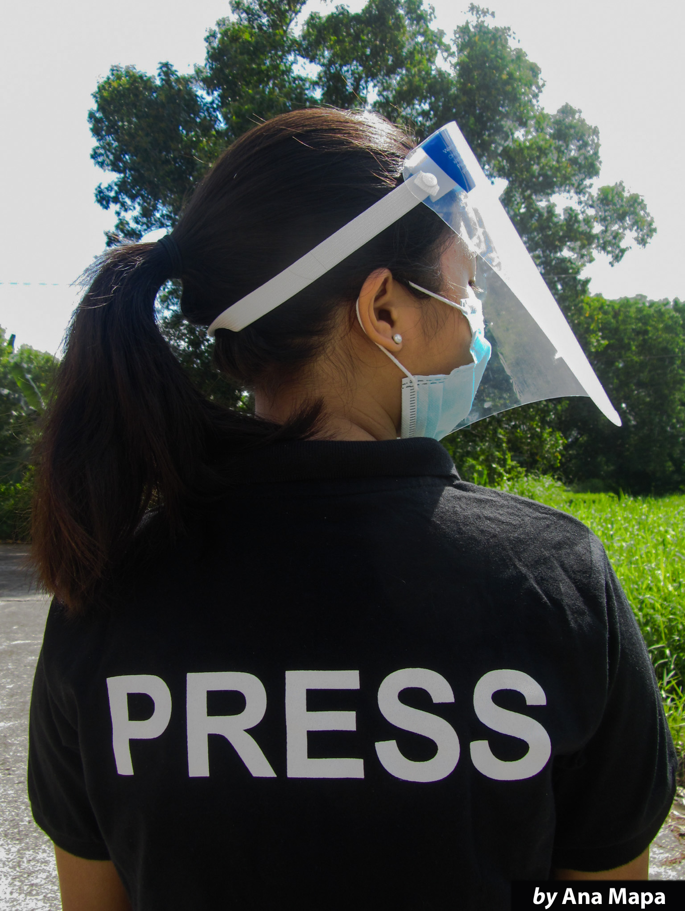
                                    

                                

                            

                            

                                

                                    

                                        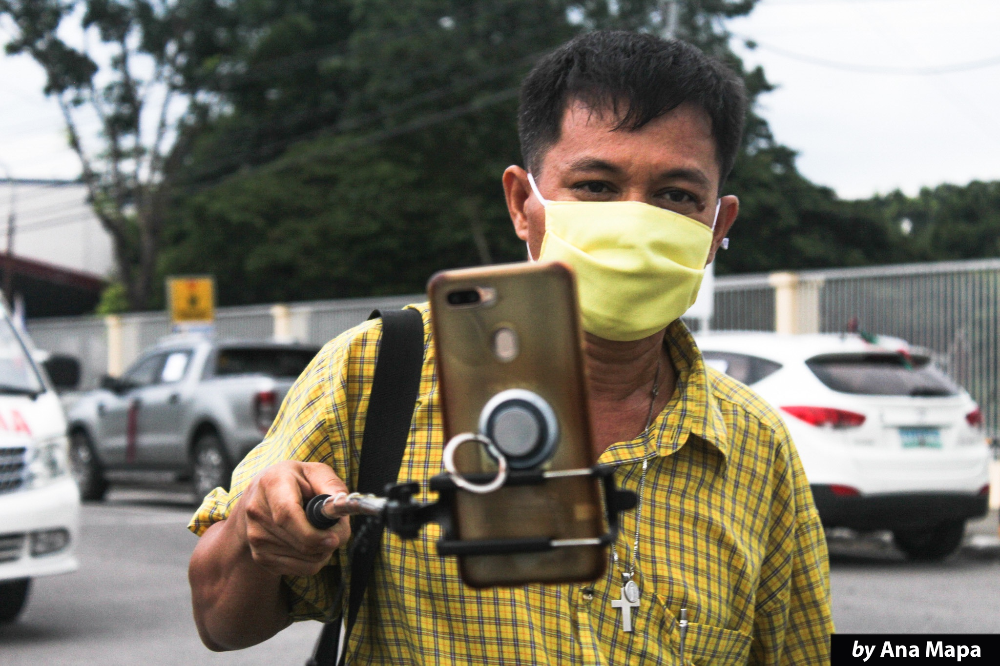
                                    

                                

                            

                            

                                

                                    

                                        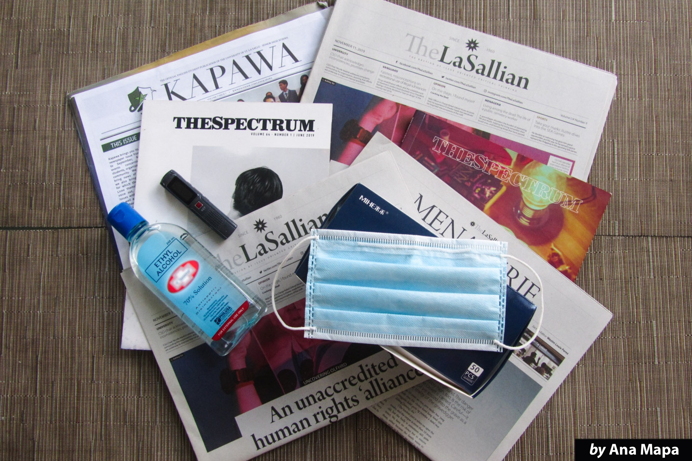
                                    

                                

                            

                            

                                

                                    

                                        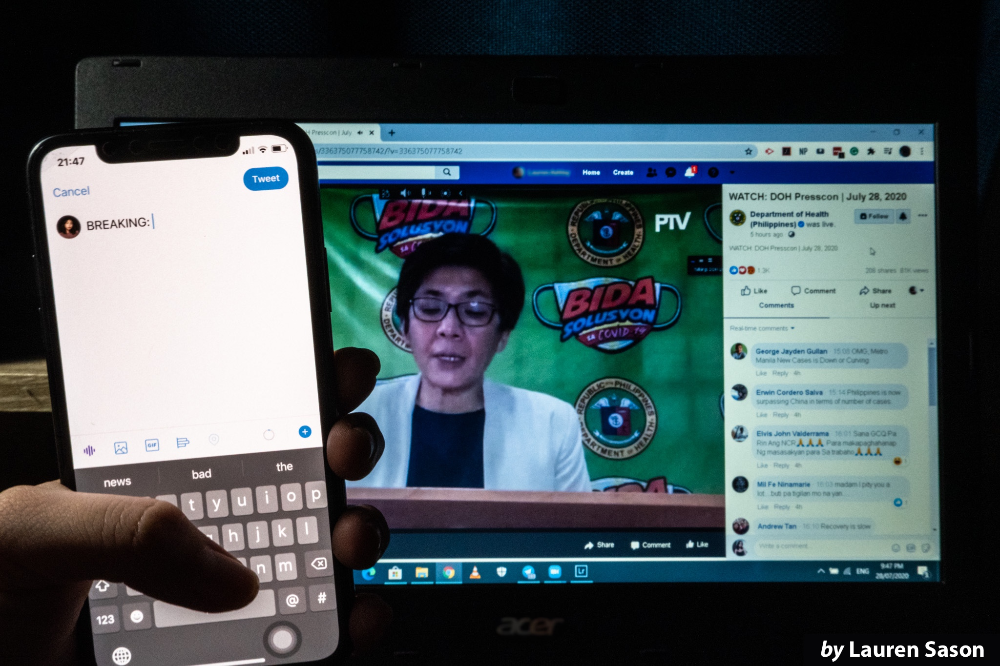
                                    

                                

                            

                            

                                

                                    

                                        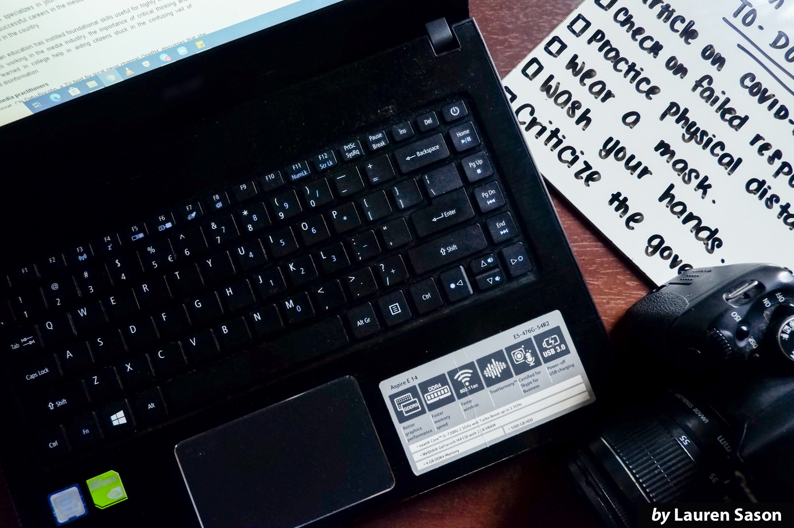
                                    

                                

                            

                            

                                

                                    

                                        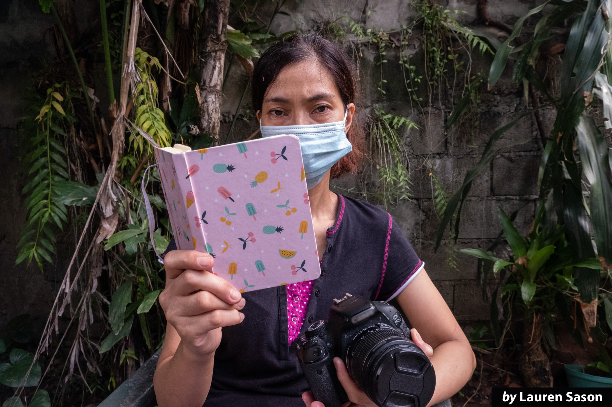
                                    

                                

                            

                            

                            

                                

                                    

                                        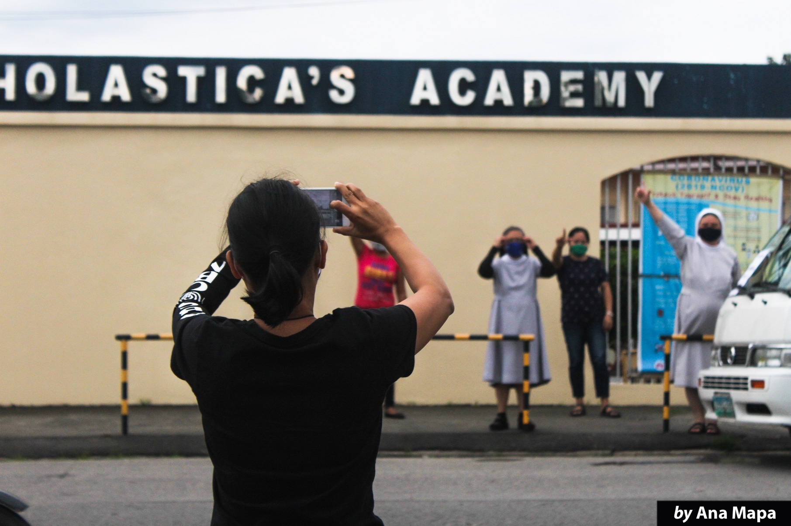
                                    

                                

                            

                        

                    

                

            

        </section>
        

        <!-- Articles -->
        <section id="articles">
            

                

                    <h1 id="title"><b>Articles</b></h1> 
                    

                        

                            

                                

                                    

                                        
                                    

                                    

                                        <h3 class="uk-card-title"><b>Guarding press freedom: Mike Navallo on the current state of Philippine media</b></h3>
                                        
by <b>Magz Chin</b> & <b>John Robert Lee</b>

                                        
Aside from being a lawyer, Mike Navallo is one of ABS-CBN's most recognized reporters. His 
                                            track-record includes covering a handful of controversial political stories.

                                    

                                

                            

                            

                                

                                    

                                        
                                    

                                    

                                        <h3 class="uk-card-title"><b>To the outskirts: The rise of alternative media</b></h3>
                                        
by <b>Jasper Buan</b> & <b>Rafael Gabriel Arceo</b>

                                        
Alternative media sheds light on stories that may be overlooked in society.

                                    

                                

                            

                            

                                

                                    

                                        
                                    

                                    

                                        <h3 class="uk-card-title"><b>In the blink of an eye: Clement Corominas, citizen journalist</b></h3>
                                        
by <b>Jacob Dy</b> & <b>Glenielle Geraldo Nanglihan</b>

                                        
It only takes a few seconds to capture history. 
                                            With the advent of social media, it now only takes a few clicks too. 

                                    

                                

                            

                            

                                

                                    

                                        
                                    

                                    

                                        <h3 class="uk-card-title"><b>In the trenches: Campus journalism in the times of dissent</b></h3>
                                        
by <b>Diego Vergel de Dios</b> & <b>Glenielle Geraldo Nanglihan</b>

                                        
In the past, campus journalists have stood for freedom and dissent. 
                                            Today, they are being called upon again as attacks against the press intensify. 

                                    

                                

                            

                            

                                

                                    

                                        
                                    

                                    

                                        <h3 class="uk-card-title"><b>Anything can happen: Pressing issues in the world of 
                                            local children's educational programming</b></h3>
                                        
by <b>Magz Chin</b> & <b>Ana Mapa</b>

                                        
Millions of kids tune in to the TV to watch their favorite shows. 
                                            How these shows are made present a different side of the screen. 

                                    

                                

                            

                            

                                

                                    

                                        
                                    

                                    

                                        <h3 class="uk-card-title"><b>Trials and tribulations: Journalists' morale in times of turmoil</b></h3>
                                        
by <b>Jan Emmanuel Alonzo</b> & <b>Ramon Enrico Martinez</b>

                                        
As journalists strive to continue working even in spite of blows to their morale, 
                                            their desire to serve their fellow Filipinos keeps them going.

                                    

                                

                            

                            

                                

                                    

                                        
                                    

                                    

                                        <h3 class="uk-card-title"><b>No more neutrality</b></h3>
                                        
by <b>Jan Emmanuel Alonzo</b>

                                        
In the midst of several social and political issues, journalists are not meant to be neutral
                                            fence-sitters but critical voices for truth and justice.

                                    

                                

                            

                            

                                

                                    

                                        
                                    

                                    

                                        <h3 class="uk-card-title"><b>Born and bred: Lasallians in media</b></h3>
                                        
by <b>John Robert Lee</b> & <b>Lauren Sason</b>

                                        
Chi Datu-Bocobo (AB-CA, '96) is a TV host for local news channel One PH. 
                                            Chesca Buencamino (AB-OC, '15) is a social media
                                            producer for CNN Philippines.

                                    

                                

                            

                            

                                

                                    

                                        
                                    

                                    

                                        <h3 class="uk-card-title"><b>Rights and limits in policing social media</b></h3>
                                        
by <b>Jasper Buan</b> & <b>Diego Vergel de Dios</b>

                                        
In an effort to create a safe space on their platforms,
                                            social media companies moderate their content according to set policies.

                                    

                                

                            

                        

                    

                

            

        </section>
        
        <!-- Vox Populi -->
        <section id="wots">
            

                

                    <h3 id="kicker"><b>VOX POPULI</b></h3>
                    <h2 id="title"><b>"What impact has journalism made on your life?"</b></h2>
                    
Graphics by <b>Ruaina Moreno</b> & <b>Lauren Sason</b>

                    

                    
Journalism influences us in many different ways. As press freedom is under threat in society,
                         students share their personal thoughts and experiences on how it impacts their life.

                    
Journalism influences us in many different ways. As press freedom is under threat in society,
                        students share their personal thoughts and experiences on how it impacts their life.
 
                    

                        

                            <ul class="uk-slider-items uk-child-width-1-3@s uk-grid">
                                <li>
                                    

                                        

                                            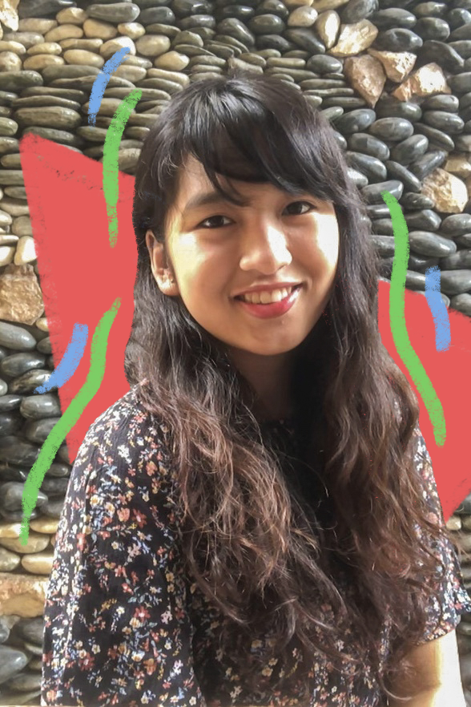
                                        

                                        

                                            <h3 class="uk-card-title" id="person">Mica Videz (II, BS-MKT)</h3>
                                            
I can say that it transformed me to become more aware of the social issues around us 
                                                and it ingrained in me how being informed is a necessity to survive.

                                        

                                    

                                </li>
                                <li>
                                    

                                        

                                            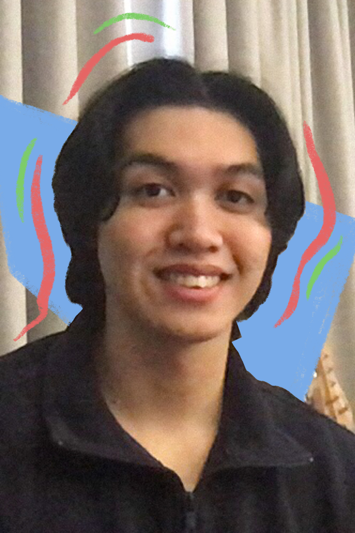
                                        

                                        

                                            <h3 class="uk-card-title" id="person">Jakey Campos (I, BS-MKT)</h3>
                                            
Journalism has left an impact on my life because it has become more and more apparent that 
                                                we live in a society that favors certain biases over others.
                                                With journalism, we are given a stepping stone towards the truth. 

                                        

                                    

                                </li>
                                <li>
                                    

                                        

                                            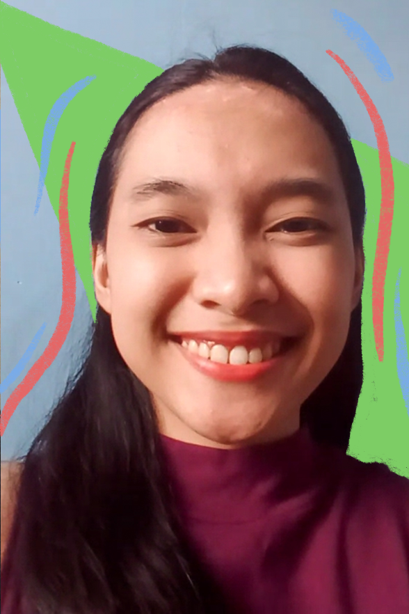
                                        

                                        

                                            <h3 class="uk-card-title" id="person">Dara Gianan (II, AB-ISE)</h3>
                                            
As a former student journalist, [journalism] has impacted my life in a sense that it taught me 
                                                the power that writing has, the importance of civilian voice and vigilance, and the standards 
                                                that the youth should have with regards to accepting information. 

                                        

                                    

                                </li>
                                <li>
                                    

                                        

                                            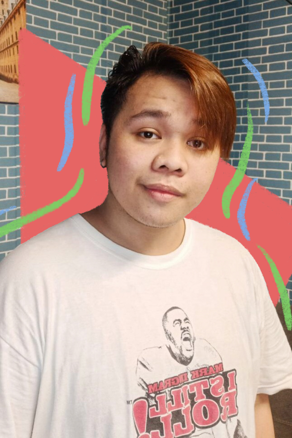
                                        

                                        

                                            <h3 class="uk-card-title" id="person">Gian Carlo Torres (II, BS-IE)</h3>
                                            
Journalism created a huge impact on my beliefs and morals as a person today.
                                                It may not always be perfect, but it always serves its purpose.

                                        

                                    

                                </li>
                                <li>
                                    

                                        

                                            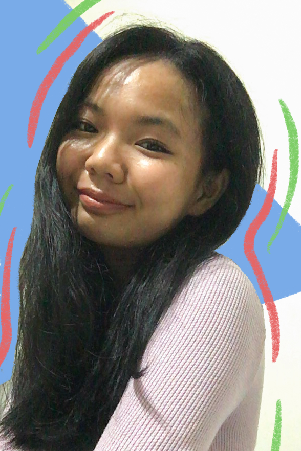
                                        

                                        

                                            <h3 class="uk-card-title" id="person">Loise Ambat (II, BS-MKT)</h3>
                                            
For me, journalism has the power to change and shape our decisions.
                                                 It also serves as a tool that bridges the gap between the government and the people.

                                        

                                    

                                </li>
                                <li>
                                    

                                        

                                            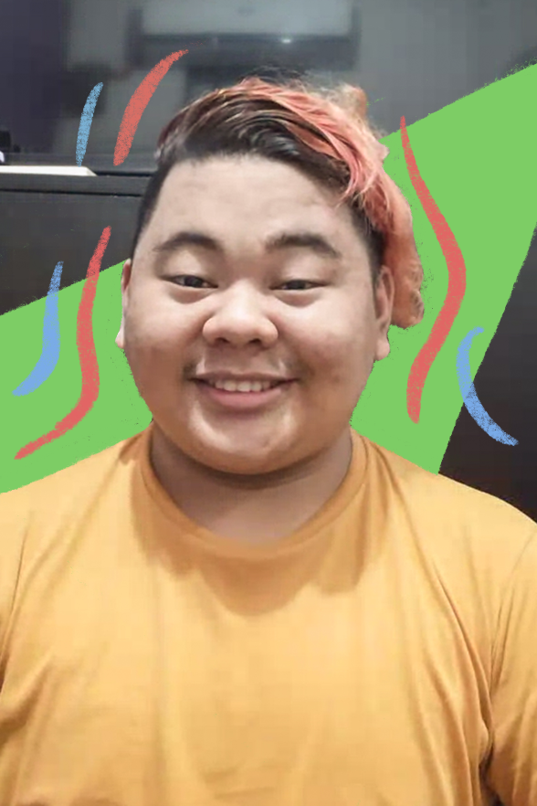
                                        

                                        

                                            <h3 class="uk-card-title" id="person">Huse Timbungco (II, AB-LIM)</h3>
                                            
 Without journalism, how else would news centers be able to broadcast what they need to show us? 
                                                Journalism is a tool for people to spread important news to the masses. 
                                                We have a lot to be thankful for thanks to journalism.

                                        

                                    

                                </li>
                            </ul>
                        

                        <!-- <ul class="uk-slider-nav uk-dotnav uk-flex-center uk-margin"></ul> -->
                    

                

            

        </section>

        <!-- Cover -->
        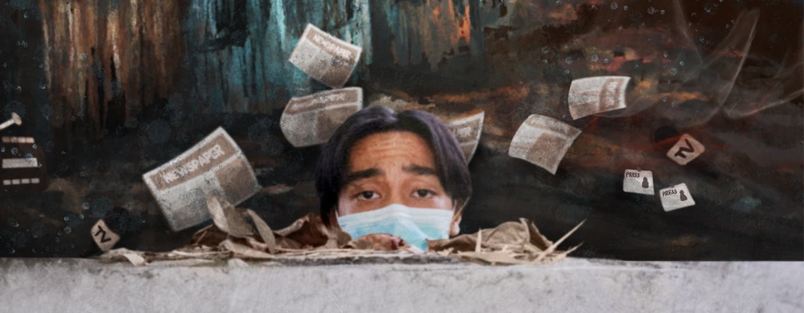

        <!-- Copyright -->
        

            

                
 ————

                

                    

                        
<b>The LaSallian</b> is the official student publication of De La Salle University. 
                            It is of the students, by the students, and for the students. 
                            Our student writers, photographers, and artists are committed to the 59-year tradition of journalistic excellence and issue-oriented critical thinking.

                    

                    

                        Copyright © The LaSallian 2020
                         Website by Rafael Gabriel Arceo and Ramon Enrico Martinez  
                        <ul class="uk-iconnav"> 
                            <li></li>
                            <li></li>
                            <li></li>
                            <li></li>
                        </ul>
                    

                

            

        

    </body>
</html>
